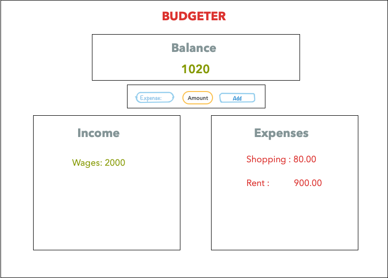
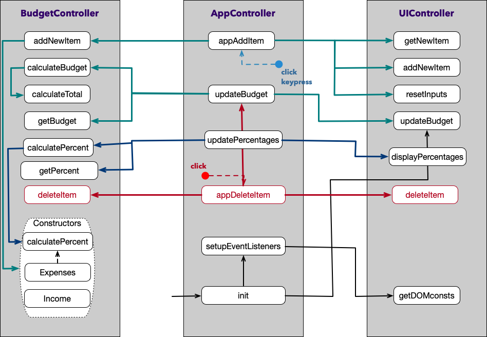

# [Budgeter](https://github.com/coderturtle/budgeter)

## Wireframe

This is a simple monthly budget app which takes in expenses and income and displays them in a ledger type view. The balance of the month is displayed at the top. A user can select from a dropdown between adding an expense or an income.

## Modules

The code is split up into 3 modules to start.
### 1. UI Module (UIController)
* Gets the expenses/income inputted by the user
* Updates the balance display
* Updates the ledger display

### 2. Data Module (BudgetController)
* Adds new items to the internal data structure
* Calculates the total expenses and total incomes
* Calculates the balance
* Takes the expenses and incomes
* Returns the balance

### 3. Controller module (AppController)
* Controls interaction between other 2 modules